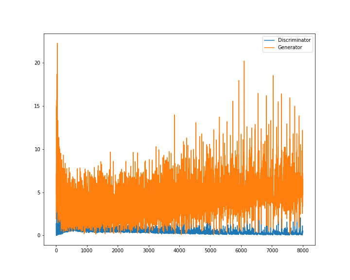

# based on DCGAN,generated cartoon pics

[cartoon pics dataset](https://pan.baidu.com/share/link?shareid=4213798357&uk=706870674) password:g5qa  
thanks for the dataset from [何之源](https://www.zhihu.com/people/he-zhi-yuan-16/activities)

# environment
- python
- pytorch
- numpy

# run code
- download dataset and unzip
- put the dataset in the directory [data/faces/](data/faces) 
- [DCGAN-faces.ipynb](DCGAN-faces.ipynb) the main code in it

# loss function
 

# generated imgs
 
